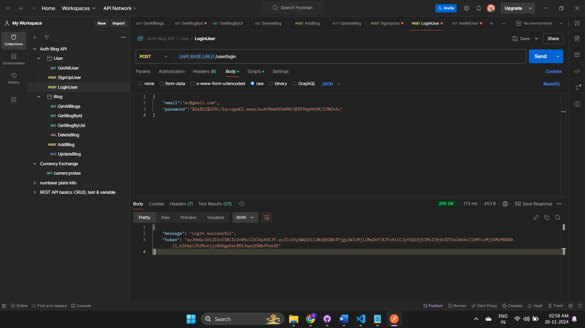

---
# [Developer @EhsaasChaudhary ](https://github.com/EhsaasChaudhary)

---

# Task Description

### Implement protected routes that require authentication to access.

---

# Demo and Screenshots :movie_camera:

## Postman collection link 

[](https://app.getpostman.com/run-collection/26063480-a9caee81-8e52-4273-9ffc-b7fe7c8e5765?action=collection%2Ffork&source=rip_markdown&collection-url=entityId%3D26063480-a9caee81-8e52-4273-9ffc-b7fe7c8e5765%26entityType%3Dcollection%26workspaceId%3D69075280-eb39-4f2e-9a37-b3cd32c5aa69)

---

# Sections :bookmark:

- User SignUp


- User Login


- get all user protected


- add blog protected


- update blog protected


- delete blog protected


- get all blog


- get blog by userID protected


- get blog by blogid


---

# How to run on local:

### You will first need to clone the project from Github into your local system


## <br />

# Getting Started :dart:

### Step 1:
Install node_module using 
```bash
npm install
```

### Step 2:
run the development server:

```bash
npm start
```

Open [http://localhost:5000](http://localhost:5000) with your postman to see the result.

---

# Usage :joystick:
## To Use api u need to get jwt token and set up env file

Goto [jwt.io](https://www.jwt.io/) and create a new account for the jwt. After setup `jwt` account, Please create a new `.env` file.

## This uses mongoDB data base for storing the records 
Goto [mongodb.com](https://www.mongodb.com/) and create a new collection to get your connection string

Eg:

```env
JWT_SECRET= your_secret_key

MONGODB_URI= your mongouri string
```

